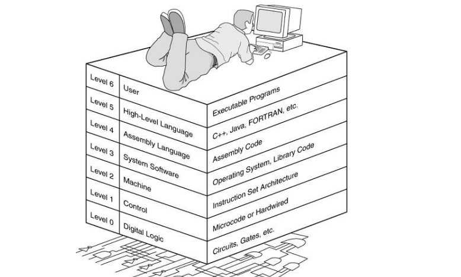

# Computer architecture


## <u>intro</u>

> ## Key Questions
> - How to program computers?
> - How to make programs executable across different hardware?
> - How to make programs backward compatible?
> - How to connect computers?
> - How to make computers efficient?
>
> ## Efficiency
> - Pipelining
> - Caching
> - etc.
>
> ## Programmability
> -  **ISA (Instruction Set Architecture):**  - Defines the set of instructions the computer can execute.  - Determines how programs are written and executed.  - Examples: x86, ARM, MIPS, RISC-V.
>

> ## What We Are Going to Study
> - How these internal components look like?
>   - Top-down approach with schematics
> - How do they fit together?
> - How to program them?
> - How to benefit from performance enhancement options?
>
> ## Focus
> - Abstract views using schematic diagrams
> - Not on how those are built using semiconductors

## <u>Com arch & com org & com des</u>


| **Aspect**               | **Computer Architecture**                                    | **Computer Organization**                                    | **Computer Design**                                          |
| ------------------------ | ------------------------------------------------------------ | ------------------------------------------------------------ | ------------------------------------------------------------ |
| **Definition**           | Conceptual design and fundamental operational structure of a computer system. | Operational units and their interconnections that realize the architectural specifications. | Implementation of the computer system and its components.    |
| **Focus**                | Logical aspects and functionality of the system visible to the programmer. | Physical components and data flow within the system.         | The actual construction and physical arrangement of the system. |
| **Concerns**             | - Instruction set architecture (ISA) <br> - Data types <br> - Addressing modes <br> - Registers <br> - Memory hierarchy | - Hardware components (ALU, CPU, memory) <br> - Circuit design <br> - Control signals <br> - Interfaces | - Circuit design <br> - Physical layout <br> - Fabrication techniques <br> - Power consumption |
| **Examples**             | - RISC vs. CISC <br> - Von Neumann vs. Harvard architecture  | - How different parts of the computer are connected <br> - Data paths <br> - Control unit operation | - Logic design <br> - Chip design <br> - PCB (Printed Circuit Board) layout |
| **Level of Abstraction** | High-level (visible to the programmer)                       | Mid-level (internal system operation)                        | Low-level (physical hardware implementation)                 |
| **Output**               | - Instruction set specifications <br> - Microarchitecture <br> - Architectural design documents | - Block diagrams <br> - Control unit design <br> - Timing and control signal diagrams | - Schematic diagrams <br> - Circuit layouts <br> - Physical components and materials list |
| **Purpose**              | Define the capabilities and programming model of a computer. | Organize hardware to meet architectural specifications.      | Build the actual computer hardware according to the organizational plan. |

------

## <mark>ISA (Instruction set architecture)</mark>

| **spect**                      | **Details**                                                  |
| ------------------------------ | ------------------------------------------------------------ |
| **Definition**                 | Part of the computer architecture related to programming, including commands and instructions. |
| **Key Components**             | - **Instruction Set:** The set of instructions the processor can execute. |
|                                | - **Data Types:** Types of data the processor can handle (integers, floats, etc.). |
|                                | - **Registers:** Small, fast storage locations in the CPU.   |
|                                | - **Addressing Modes:** Methods to specify operands for instructions. |
|                                | - **Instruction Formats:** Layout of bits in an instruction. |
| **Categories of Instructions** | - **Data Transfer:** MOVE, LOAD, STORE.                      |
|                                | - **Arithmetic and Logic:** ADD, SUBTRACT, AND, OR, NOT.     |
|                                | - **Control Flow:** JUMP, CALL, RETURN.                      |
|                                | - **Input/Output:** IN, OUT.                                 |
| **Examples of ISAs**           | - **x86:** CISC architecture used in most personal computers. |
|                                | - **ARM:** RISC architecture used in most mobile devices.    |
|                                | - **MIPS:** RISC architecture used in embedded systems and academia. |
|                                | - **RISC-V:** Open-source RISC architecture popular in research and development. |
| **Design Considerations**      | - **Simplicity vs. Complexity:** Balancing simple (RISC) and complex (CISC) instruction sets. |
|                                | - **Compatibility:** Ensuring backward compatibility with previous processor generations. |
|                                | - **Performance:** Optimizing the instruction set for common operations. |
|                                | - **Power Consumption:** Minimizing energy usage in mobile and embedded systems. |
| **Importance**                 | - **Programming:** Defines how programmers and compilers control the hardware. |
|                                | - **Hardware Design:** Influences processor design and complexity. |
|                                | - **Performance Optimization:** Helps tune software for specific hardware. |
|                                | - **Software Portability:** Ensures software runs on different implementations of the same ISA. |
| **Focus Areas in ISA Studies** | - **Instruction Encoding:** Understanding binary representation of instructions. |
|                                | - **Pipeline Design:** Analyzing execution stages to improve throughput. |
|                                | - **Microarchitecture:** Studying ISA implementation in processor design. |
|                                | - **Assembly Language:** Learning low-level programming language related to the ISA. |

 

| Type                  | Characteristics                                              | Example Architectures    |
| --------------------- | ------------------------------------------------------------ | ------------------------ |
| **CISC**              | Large instruction set, variable length, complex addressing modes | x86, VAX                 |
| **RISC**              | Small instruction set, fixed length, load/store architecture | ARM, MIPS, RISC-V, SPARC |
| **VLIW**              | Long instruction words, compiler-managed parallelism, simple hardware | Intel Itanium, TI TMS320 |
| **EPIC**              | Similar to VLIW, with additional parallel execution features | Intel Itanium            |
| **Stack-Based**       | Operands on a stack, few registers, implicit operand usage   | JVM, Forth               |
| **Accumulator-Based** | Single accumulator for most operations, simpler instruction set | PDP-8                    |
| **Register-Memory**   | Operations between registers and memory                      | x86                      |
| **Memory-Memory**     | Operations directly between memory locations                 | VAX                      |


#### 1. A good ISA


#### 2. RISC vs CISC


## <u>Microarchitecture and Instruction Set Architecture</u>

In this article, we look at what an *Instruction Set Architecture (ISA)* is and what is the difference between an **‘ISA’** and *Microarchitecture*. An **ISA** is defined as the design of a computer from the *Programmer’s Perspective*. 

This basically means that an **ISA** describes the **design of a Computer** in terms of the **basic operations** it must support. The ISA is not concerned with the implementation-specific details of a computer. It is only concerned with the set or collection of basic operations the computer must support. For example, the AMD Athlon and the Core 2 Duo processors have entirely different implementations but they support more or less the same set of basic operations as defined in the x86 Instruction Set. 

Let us try to understand the Objectives of an ISA by taking the example of the **MIPS ISA**. MIPS is one of the most widely used ISAs in education due to its simplicity. 

1. The ISA defines the types of instructions to be supported by the processor. 

   Based on the type of operations they perform MIPS Instructions are classified into 3 types: 

   - **Arithmetic/Logic Instructions:** 
     These Instructions perform various Arithmetic & Logical operations on one or more operands.
   - **Data Transfer Instructions:** 
     These instructions are responsible for the transfer of instructions from memory to the processor registers and vice versa.
   - **Branch and Jump Instructions:** 
     These instructions are responsible for breaking the sequential flow of instructions and jumping to instructions at various other locations, this is necessary for the implementation of *functions* and *conditional statements*. 
     

2. The ISA defines the maximum length of each type of instruction. 

   Since the MIPS is a 32 bit ISA, each instruction must be accommodated within 32 bits. 
   
3. The ISA defines the Instruction Format of each type of instruction. The Instruction Format determines how the entire instruction is encoded within 32 bits 

   There are 3 types of Instruction Formats in the MIPS ISA: 

   - R-Instruction Format
   - I-Instruction Format
   - J-Instruction Format

If we look at the Abstraction Hierarchy: 

 


We note that the **Microarchitectural** level lies just below the **ISA** level and hence is concerned with the implementation of the basic operations to be supported by the Computer as defined by the **ISA**. Therefore we can say that the AMD Athlon and Core 2 Duo processors are based on the same ISA but have different microarchitectures with different performance and efficiencies. 

Now one may ask the need to distinguish between **Microarchitecture** and **ISA**? 

The answer to this lies in the need to standardize and maintain the compatibility of programs across different hardware implementations based on the same **ISA**. Making different machines compatible with the same set of basic instructions (The ISA) allows the same program to run smoothly on many different machines thereby making it easier for the programmers to document and maintain code for many different machines simultaneously and efficiently. 

This Flexibility is the reason we first define an ISA and then design different microarchitectures complying with this ISA for implementing the machine. The design of a lower-level ISA is one of the major tasks in the study of Computer Architecture. 

 

|                 Instruction Set Architecture                 |                      Microarchitecture                       |
| :----------------------------------------------------------: | :----------------------------------------------------------: |
| The ISA is responsible for defining the set of instructions to be supported by the processor. For example, some of the instructions defined by the ARMv7 ISA are given below. | The Microarchitecture is more concerned with the lower level implementation of how the instructions are going to be executed and deals with concepts like Instruction Pipelining, Branch Prediction, Out of Order Execution. |
| The Branch of **Computer Architecture** is more inclined towards the Analysis and Design of Instruction Set Architecture. For Example, Intel developed the *x86* architecture, ARM developed the *ARM* architecture, & AMD developed the *amd64* architecture. The RISC-V ISA developed by UC Berkeley is an example of an Open Source ISA. | On the other hand, the Branch of **Computer Organization** is concerned with the implementation of a particular ISA deals with various hardware implementation techniques, i.e. is the Microarchitecture level. For Example, ARM licenses other companies like Qualcomm, Apple for using ARM ISA, but each of these companies have their own implementations of this ISA thereby making them different in performance and power efficiency. The *Krait* cores developed by Qualcomm have a different microarchitecture and the Apple A-series processors have a different microarchitecture. |

The *x86* was developed by Intel, but we see that almost every year Intel comes up with a new generation of i-series processors. The *x86* architecture on which most of the Intel Processors are based essentially remains the same across all these generations but, where they differ is in the underlying Microarchitecture. They differ in their implementation and hence are claimed to have improved Performance. These various Microarchitectures developed by Intel are codenamed as ‘Nehalem’, ‘Sandybridge’, ‘Ivybridge’, and so on. 

Therefore, in conclusion, we can say that different machines may be based on the same ISA but have different Microarchitectures.

------

## <u>Different level of abstraction</u>

| **Level of Abstraction**            | **Description**                                              | **Focus Areas**                                              | **Examples**                                                 |
| ----------------------------------- | ------------------------------------------------------------ | ------------------------------------------------------------ | ------------------------------------------------------------ |
| **Block/Hierarchical Architecture** | Decomposes the system into manageable blocks or modules, each with specific functions. | - System Organization <br> - Functional Blocks <br> - Data Flow Between Modules | - Block diagrams <br> - System schematics <br> - Subsystem designs |
| **Register Transfer Level (RTL)**   | Describes the system in terms of registers and the transfers of data between them. | - Register Operations <br> - Data Path Design <br> - Control Path Design | - Hardware Description Languages (HDLs) like VHDL and Verilog |

**Block/Hierarchical Architecture:**

- **Description:** This level breaks down the system into smaller, manageable blocks or modules. Each block or module is responsible for a specific function or set of functions, making the system easier to design, understand, and maintain. The focus is on the overall organization and the interactions between different blocks.
- **Focus Areas:** System organization, functional blocks, data flow between modules.
- **Examples:** Block diagrams, system schematics, subsystem designs.

**Register Transfer Level (RTL) Architecture:**

- **Description:** At this level, the system is described in terms of registers and the operations performed on the data stored in these registers. The RTL abstraction specifies how data moves between registers and how the control signals manage these transfers. It is often used in designing and verifying digital circuits.
- **Focus Areas:** Register operations, data path design, control path design.
- **Examples:** Hardware Description Languages (HDLs) like VHDL and Verilog.

These two levels of abstraction help in designing complex systems by breaking them down into smaller, more manageable parts and focusing on data flow and control mechanisms.

------

## <u>Execution of a program in programmers perspective</u>


------

## <u>Views of a computer</u>

### 1.High-Level View


### 2. 2<sup>nd</sup> level view


### 3. 3<sup>rd</sup> level view with block level abstraction


------

## <u>Recap</u>

#### 											1.ALU


​											

#### 											2.Registers


## <u>Key Architectural Differences in Microprocessors</u>


------

## <u>Microprocessor vs microcontroller</u> 


| Feature                 | Microprocessor                                        | Microcontroller                                           |
| ----------------------- | ----------------------------------------------------- | --------------------------------------------------------- |
| **Purpose**             | General-purpose computing (executing instructions)    | Specific-purpose control (embedded systems applications)  |
| **Components**          | CPU core, typically lacks integrated peripherals      | CPU core, integrated memory (RAM, ROM/Flash), peripherals |
| **External Components** | Requires external memory, peripherals, and interfaces | Often self-contained with built-in memory and peripherals |
| **Complexity**          | Higher complexity, more powerful                      | Lower complexity, often optimized for low power and cost  |
| **Applications**        | PCs, servers, high-end computing                      | Embedded systems, IoT devices, control systems            |
| **Examples**            | Intel x86, ARM Cortex-A series                        | Arduino (AVR/ARM), PIC microcontrollers                   |
| **Usage**               | Used in systems requiring high computational power    | Used in systems requiring real-time control and low power |


------

## <u>Programming Hierarchies</u>



## <u>Programming language levels</u>

1. **Machine Language (Level 1):**

   - Machine language consists of binary code directly understood by the computer's CPU.
   - Example: The binary code for adding two numbers might be something like `00110011` (representing an addition operation).

2. **Assembly Language (Level 2):**

   - Assembly language uses mnemonic codes (symbols) to represent machine code instructions.

   - Example: Assembly code for adding two numbers might look like:

     ```assembly
     MOV AX, 5   ; Move 5 into register AX
     ADD AX, 3   ; Add 3 to register AX
     ```

3. **Low-Level Languages (Level 3):**

   - These languages provide a higher level of abstraction over assembly language.

   - Example: C is a classic example of a low-level language that allows direct manipulation of hardware resources:

     ```c
     #include <stdio.h>
     
     int main() {
         int a = 5;
         int b = 3;
         int sum = a + b;
         printf("Sum: %d\n", sum);
         return 0;
     }
     ```

4. **High-Level Languages (Level 4):**

   - High-level languages are designed to be more abstracted from hardware and closer to human languages.

   - Example: Python is a high-level language known for its simplicity and readability:

     ```python
     a = 5
     b = 3
     sum = a + b
     print(f"Sum: {sum}")
     ```

5. **Very High-Level Languages (Level 5):**

   - These languages provide extensive libraries and frameworks, often focused on specific domains or problem areas.

   - Example: SQL (Structured Query Language) is a very high-level language used for querying databases:

     ```sql
     SELECT name, age FROM users WHERE age > 18;
     ```

Each level of programming language offers increasing levels of abstraction, allowing programmers to focus more on problem-solving rather than low-level details of hardware interaction.

------

# <u>The quantitative approach</u>

The quantitative approach to building computer architecture involves the use of measurable and empirical data to inform design decisions and evaluate the performance of different architectural components and systems. This approach is essential for ensuring that a computer architecture meets its performance, power, cost, and reliability goals. Here are the key aspects of the quantitative approach:

1. **Performance Metrics**:
   - **Execution Time**: The total time taken to execute a program.
   - **Throughput**: The number of tasks a system can complete in a given period.
   - **Latency**: The delay between the start and completion of a task.
   - **Cycles Per Instruction (CPI)**: The average number of clock cycles per instruction.
2. **Benchmarking**:
   - Using standardized benchmarks to evaluate and compare the performance of different architectures.
   - Common benchmarks include SPEC CPU, TPC for databases, and various micro-benchmarks for specific tasks.
3. **Amdahl’s Law**:
   - A principle that helps in understanding the potential speedup of a system when only a part of the system is improved.
   - It states that the overall performance improvement gained by optimizing a single part of a system is limited by the fraction of time that the improved part is actually used.
4. **Power and Energy Efficiency**:
   - Measuring power consumption and energy efficiency to ensure that the architecture meets power constraints and thermal limits.
   - Metrics include power per operation, energy per operation, and performance per watt.
5. **Cost-Performance Analysis**:
   - Balancing the cost of architectural components against the performance benefits they provide.
   - This includes considerations of silicon area, manufacturing costs, and the economic impact of design choices.
6. **Simulation and Modeling**:
   - Using simulation tools to model and predict the performance of architectural designs before physical implementation.
   - Tools like gem5, Simics, and various FPGA-based emulators are used for this purpose.
7. **Profiling and Bottleneck Analysis**:
   - Identifying and analyzing performance bottlenecks in the system to focus optimization efforts.
   - Profiling tools help in understanding which parts of the architecture are the most performance-critical.
8. **Design Trade-offs**:
   - Making informed trade-offs between different design aspects such as speed, area, power, and complexity.
   - Understanding that improving one aspect often comes at the expense of another, and finding the optimal balance is crucial.
9. **Reliability and Fault Tolerance**:
   - Quantifying the reliability of different architectural components and systems.
   - Techniques such as error correction codes (ECC), redundant systems, and failover mechanisms are evaluated for their impact on overall reliability.
10. **Scalability**:
    - Ensuring that the architecture can scale efficiently with increasing workload or number of cores.
    - Analyzing how performance metrics change with scale and identifying any potential scalability bottlenecks.

------

# Day 2

## <u>1. Instruction execution cycle</u>


## <u>2. Execution of a program</u>

#### 1.nano processor


#### 2.Risc-V


------

##### sample program


```assembly
.data
A: .word 10      # Initialized variable A with value 10

.bss
array: .space 100  # Uninitialized space for an array of 100 bytes

.text			#This shows the begining of the main
.globl main     # Declare the main function as global

main:
    la a0, A    # Load the address of variable A into register a0
    lw t0, 0(a0)  # Load the word at address in a0 (value of A) into register t0
    li t1, 15   # Load the immediate value 15 into register t1
    add t0, t0, t1  # Add the values in t0 and t1, and store the result in t0
    sw t0, 0(a0)  # Store the word in t0 into the address in a0 (update the value of A)
    ret          # Return from the main function
```

## <u>3. Assembling and linking</u>


------


 