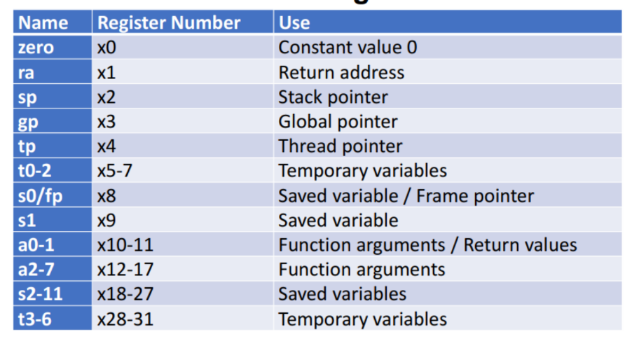
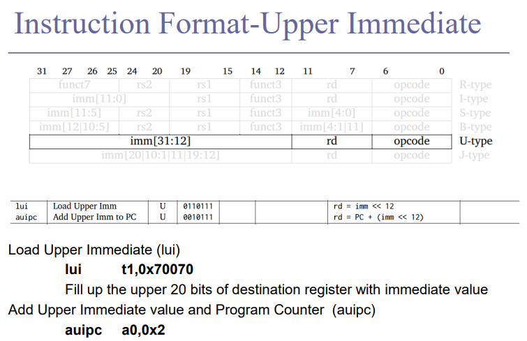
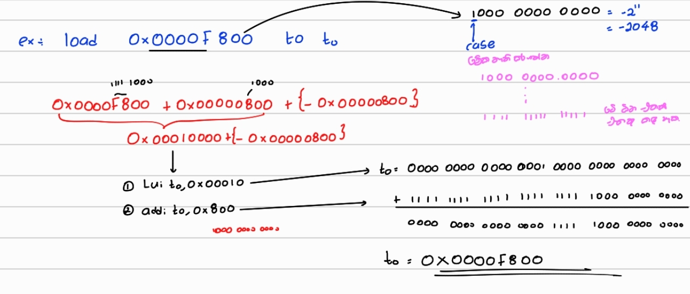
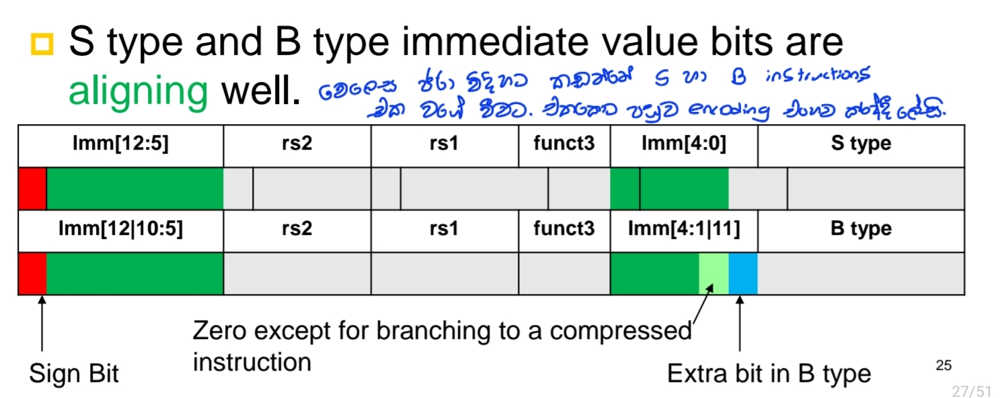
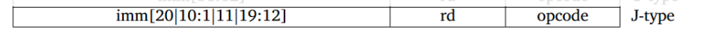

# 			<mark>Introduction to RISC - V</mark>	


RISC-V is an open standard, in fact, the specification is public domain, and 
it has been managed since 2015 by the RISC-V Foundation, now called 
RISC-V International, a nonprofit organization promoting the development 
of hardware and software for RISC-V architectures.


## Basics

> [!TIP]
>
> ## <u>RISC-V has 32 , 32bit registers</u>
>
> 
>
> ## 
>
> ## <u>RISC -V Base and Extensions</u>
>
> 
>
> 
>
> 
>
> ## <u>Instruction Variants and Modules</u>
>
> *Base Options/Variants:*
>
> - 32 General Purpose Registers with ISA word size:
>   - RV32I :- 32(num of bits) / I:(base instruction set)
>   - RV64I
>   - RV128I
> - **RV32E** (for embedded devices, only 16 registers available)
>
> #### *Modular rather than Incremental:*
>
> - **Extensions:**
>   - **M**: Multiply/Division
>   - **A**: Atomic extensions
>   - **F**: Floating point
>   - **D**: Double precision Floating Point
>   - <mark>In a general purpose computer we need all these modules.</mark>
>   - **RV32IMAFD** or **RV32IG** (G - General, same as MAFD)
> - **Other Extensions:**
>   - **B**: Bit manipulation extension
>   - **C**: Compressed extension (More efficient encoding of instructions, reducing code size)
>   - **N**: User-level interrupts
>
> Proprietary extensions can be developed for your own applications.
>
> Example:
>
> - 64-bit RISC-V implementation:
>   - Including all four general ISA extensions plus Bit Manipulation and User Level Interrupts
>   - Referred to as an **RV64GBN ISA**
>
> Notes:
>
> - Can find out what modules are available by observing the `misa` status register.
>
> ------
>
> ## <u>Encoding instructions</u>
>
> ### *Various Instruction Types:*
>
> - RISC-V supports a variety of instruction types, each with different formats and purposes.
>
> ### *Limited Word Size:*
>
> - Registers, addresses, and instructions are all constrained by a limited word size.
> - For RV32I, the word size is 32 bits.
> - All instructions are 32 bits in length.
>
> ### *Example - Loading an Immediate Value:*
>
> - If we need to load an immediate value into a 32-bit register, we must fit the opcode and operands within a 32-bit instruction.
> - This can be challenging due to the limited space available.
>
> ### *Strategies:*
>
> 1. **Work with Small Numbers:**
>    - Utilize smaller immediate values when possible.
>    - Immediate values are often limited to a certain number of bits within the instruction format.
> 2. **Make Compromises:**
>    - Split operations into multiple instructions if necessary.
>    - Use instruction formats that balance the need for various fields (opcode, operands, immediate values).
>
> ### *Example of Load Immediate Instruction:*
>
> - **LUI (Load Upper Immediate):** Loads a 20-bit immediate value into the upper 20 bits of a register.
> - **ADDI (Add Immediate):** Adds a 12-bit immediate value to a register.
>
> By combining these instructions, larger immediate values can be loaded into a register.
>
> 
>
> ------
>
> ##### Logical shift vs Arithmetic shift
>
> 
>
> ###### <u>Logical Shifts applications:</u>
>
> 1. **Logical Shift Left (SLL)**:
>    - **Operation**: Shifts bits to the left, filling vacant LSBs with zeros.
>    - **Effect**: Multiplies the value by 2<sup>n</sup> , where n is the number of positions shifted.
>    - **Example**: Shifting 5 (binary 101)  left by 1 bit gives 10 (binary 1010).
> 2. **Logical Shift Right (SRL)**:
>    - **Operation**: Shifts bits to the right, filling vacant MSBs with zeros.
>    - **Effect**: Divides the value by 2<sup>n</sup>, discarding any remainder, where n is the number of positions shifted.
>    - **Example**: Shifting 10 (binary 1010) right by 1 bit gives 5 (binary 0101).
>
> ###### <u>Arithmetic Shift applications:</u>
>
> This is used for signed values.
>
> 1. Arithmetic Shift Right (SRA):
>    - **Operation**: Shifts bits to the right, preserving the sign bit (MSB).
>    - **Effect**: Divides the value by 2<sup>n</sup>, where n is the number of positions shifted, while preserving the sign for negative numbers.
>    - **Example**: Shifting -10 (binary 11110110 in 8-bit two's complement) right by 1 bit gives -5 (binary 11111011).


## <u>Instruction Formats in RISC-V</u>

| Instruction Type | Purpose                                                      | Fields                                                       | Example             |
| ---------------- | ------------------------------------------------------------ | ------------------------------------------------------------ | ------------------- |
| R-type           | Instructions using three register inputs Arithmetic and logical operations | opcode (7), rd (5), funct3 (3), rs1 (5), rs2 (5), funct7 (7) | `ADD rd, rs1, rs2`  |
| I-type           | Arithmetic/logical operations with immediate, Load instructions | opcode (7), rd (5), funct3 (3), rs1 (5), imm (12)            | `ADDI rd, rs1, imm` |
| S-type           | Store instructions                                           | opcode (7), imm[4:0] (5), funct3 (3), rs1 (5), rs2 (5), imm[11:5] (7) | `SW rs2, imm(rs1)`  |
| B-type           | Conditional branch instructions                              | opcode (7), imm[4:0] (5), funct3 (3), rs1 (5), rs2 (5), imm[11:5] (7) | `BEQ rs1, rs2, imm` |
| U-type           | Upper immediate                                              | opcode (7), rd (5), imm (20)                                 | `LUI rd, imm`       |
| J-type           | Jump instructions                                            | opcode (7), rd (5), imm[19:12] (8), imm[11] (1), imm[10:1] (10), imm[20] (1) | `JAL rd, imm`       |


------

### 1. R Type (register type)


##### R - type example


------

### 2. I Type (Immediate type)

Immediate type instructions allow us to use immediate values within a constrained number of bits. Here’s a breakdown of how they are structured:

- **rs1 and rs2 fields:** Each field is 5 bits, typically used for register operands. Not enough to hold sufficiently large values.
- **funct7 and rs2:** Dedicated for representing larger immediate values.
- <mark>lb,lw,lh,lbu,lhu These are also immediate instructions becouse we are giving the address of the required data as immediate value</mark>  

Example 

```assembly
addi x1, x2, 10    // Adds immediate value 10 to register x2 and stores the result in x1
lw x3, 100(x4)     // Loads the value from memory at address x4 + 100 into register x3
```


##### example 1 (addi)


##### example 2 (andi)


##### example 3 (lw - Memory related)

<mark> immediate value = offset</mark>


##### example 4 (lh - memory related)


> # Largest Immediate Value for `addi` Instruction
>
> ## Immediate Values
>
> - Immediate(12): 12-bit number
>   - All computations done in words, so 12-bit immediate must be extended to 32 bits.
>   - <mark>Always sign-extended to 32-bits before use in an arithmetic operation.</mark>
>
> ## Determining the Largest Immediate Value
>
> - **12-bit Range**: 
>   - Range of Two’s complement: <mark>\(-2048\) to \(2047\)</mark>.
>
> - **Sign Extension**: 
>   - Before use, the 12-bit immediate value is extended to 32 bits.
>
> - **Largest Immediate Value for `addi`**:
>   - Considering sign extension, the largest immediate value is \(2047\).
>
> 

##### exercise

> 
>
> .png)
>
> <mark>-4 kiyana eka 12 bit walin liyagannawa. But yam operation ekak karana wita meka 32 bit walata extend kala yuthui, For that we extend the MSBs to 32 bits by repeating the MSB in the 12 bit value</mark>
>
> In RISC-V, when working with instructions like **AND immediate** (`andi`), the immediate value is typically 12 bits long, but the registers (such as `x5` and `x6`) are 32 bits. This means that any immediate value in the instruction needs to be sign-extended to match the size of the register (32 bits in this case).
>
> **Sign extension:** The processor automatically **sign-extends** the 12-bit immediate value to 32 bits before performing the operation.

------


### 3.U type (Upper immediate)




##### example 1 (Lui)


> [!CAUTION]
>
> Some instructions are difficult to get done with a single instruction.
>
> Example 1:  Load immediate value 0x700707FF (or any 32 bits long number) to  x6 register
>
> 
>
> 
>
> Example 2:
>
> 
>
> 

This is hard. So there comes pseudo instructions.


------


### 4. S type ( Store instructions)


Example: `sw x14, 8(x2)`  sw, sh(save half of a word), sb (save byte)

<mark>rs2-x14        rs1-x2 </mark>

Breakdown:

- **Instruction**: `sw x14, 8(x2)`

- Meaning: Store the word (32-bit value) from register 

  ```
  x14
  ```

   into the memory location calculated as the value in register 

  ```
  x2 plus 8
  ```

  - `x2` holds the base memory address.
  - `8` is the immediate offset added to `x2` to compute the final memory address.
  - The value from `x14` is stored at the calculated memory address.

##### example 1 (SW)


##### example 2 (SW)


------

### 5. B type ( Branching ins)


> [!TIP]
>
>   Need to specify an address to go to
>
>   Also take two registers to compare  ◼ Conditional branch
>
>   Doesn’t write into a register (similar to stores) (destination register rd is not required)

##### Addressing in B type


##### example 1 (bne)





Pseudo

```assembly
main:
addi t0,zero,10
    add t1,zero,zero
repeat:
    addi t1,t1,1
    bne t0,t1,repeat    # instead of bne t0,t1,-4 we can use  bne t0,t1,repeat by pseudo instructions
    ret
.end
```


------

### 6. J type (jump instructions)

- Jumps to anywhere in the memory : Need the proper 32 bit address
- <mark>Linking</mark>Store a return address in a register Rd , So that you can come back to the original flow 
- 
- 


### 7. Some Pseudo instructions


Programmers Perspective 

◼  We don’t know memory addresses.  

◼  Let us write memory position independent code 

◼ Ask the assembler to declare a data section along  with the instruction sequence 

◼ auipc instruction allows to address relative to  program counter.

```assembly
.data 
A: .word 0x1F2F3F4F
.text
.globl main
main:
	la a0, A 
	# Pseudo instruction la (How it works? will discuss in next slide)
	# Load the address of symbol to the register 
	
	li t1, 0x1E2E3E4E
	
	lw t0, 0(a0) 
	# Get the value in a0 address, byte offset 0 and load it to t0 register
	
	sw t1, 0(a0) 
	# Store value in t1 to A, at byte offset of 0 
	
	ret
.end
```

