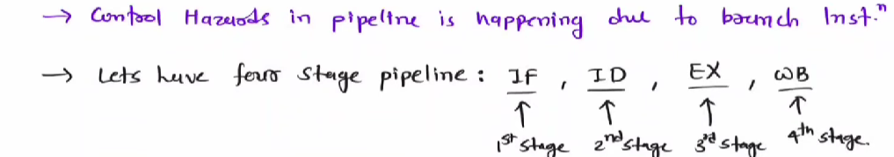

# 			<u>Pipelining</u>

## Basics

## 

- Pipelining improves the **throughput** of the entire workload but doesn't reduce the **latency** of individual tasks.
- The pipeline's speed is limited by the **slowest stage**, as all stages must complete before advancing.
- **Multiple tasks** can be processed simultaneously, each at a different stage of the pipeline.
- The potential speedup from pipelining is approximately equal to the number of pipeline stages, but **unbalanced stage lengths** and the time taken to **<u>fill or flush</u>** the pipeline reduce the actual speedup achieved.

> [!IMPORTANT]
>
> The speedup achieved by pipelining can be expressed using the following equation:
> $$
> \text{Speedup} = \frac{\text{Time per instruction (non-pipelined)}}{\text{Time per instruction (pipelined)}}
> $$
> For an ideal pipeline with **n** stages, the speedup is:
> $$
> Speedup\approx \frac{n}{1 + \text{Pipeline stalls}}
> $$
> Where:
>
> - **n** is the number of pipeline stages.
> - **Pipeline stalls** refer to delays caused by hazards, imbalanced stages, or other inefficiencies.
>
> In an ideal scenario (with no stalls), the speedup approaches **n** (the number of pipeline stages). However, real-world factors like hazards and the need to fill/flush the pipeline reduce the actual speedup.

## Pipelining with RISC architecture

**RISC Characteristics: Key Points**

- **Operations on data** apply to the entire data register, meaning operations are uniform across the entire register.

- The only operations that interact with memory are **load** and **store** instructions, keeping data manipulation within registers.

- **Memory-register transfers** can handle data smaller than the full register size, allowing partial data transfers.

- **Instructions** are typically of a fixed size, with register specifiers always positioned consistently, simplifying decoding and other stages.

- These characteristics allow for easier  pipeline implementation, as seen in a standard 

  <mark>5-stage pipeline</mark>:

  

  1. **IF** (Instruction Fetch)
  2. **ID** (Instruction Decode)
  3. **EX** (Execution)
  4. **MEM** (Memory Access)
  5. **WB** (Write Back)

$$
Speedup ~~={5n}/{(n+4)}
$$

> ### Throughput
>
> **Throughput** refers to the amount of data or work that is successfully processed by a system or transmitted over a network in a given amount of time. It's a measure of performance and efficiency
>
> n- number of instructions                       k - number of stages in pipelining
>
> <mark>ideal wita n = infinity kiyala gani</mark>
>
> 

> ## Utilization / Efficiency
>
> 
>
> These free spaces are not utilized. Therefore in pipelining we can't say efficiency is 100%
> $$
> Efficiency= \frac{number~~ of ~~utilized~~ stages}{total~~number~~of~~stages}= \frac{n*k}{k*(k+n-1)}
> $$
>
> $$
> speed~up = efficiency~*~k
> $$
>
> 

## **Issues in Pipelining:**

- **Resource conflicts** can occur when two operations need the same data path resources at the same clock cycle, causing stalls or delays.

- **Operation interference** arises when overlapping operations access shared resources or registers.

- **Imbalance** in pipeline stages can reduce the expected speedup, as the slowest stage limits the overall performance.

- **Pipeline overhead** comes from the additional control logic needed to manage the flow of instructions through the stages.

- **Pipeline register delay** and **clock skew** occur when registers between stages require setup time and the clock edges arrive at different times.

- > [!TIP]
  >
  > ### Key Points about Clock Skew:
  >
  > 1. **Definition**:
  >    - **Clock skew** is the **difference in the arrival times** of the clock edge at two or more registers or components within a circuit.
  > 2. **Causes**:
  >    - **Propagation delays** in the clock distribution network, where the clock signal may travel longer distances or through different paths to reach various components.
  >    - Variations in **wiring capacitance, resistance,** and **clock buffer** delays.
  >    - Different manufacturing variations or changes in environmental factors like **temperature** and **voltage** can also contribute to clock skew.
  > 3. **Impact on Pipelining**:
  >    - In a pipelined system, if the clock signal does not arrive at all registers simultaneously, this mismatch can cause some stages to update before others, leading to incorrect data propagation.

  

**Solutions to Pipeline Issues:**

- **Separate instruction and data memories** with separate caches can eliminate memory access conflicts.

- Manage the **register file usage** by splitting read and write operations into different halves of the clock cycle to avoid conflicts.

- Insert **pipeline registers** between successive stages to ensure smooth operation and reduce interference between instructions at different stages.

- Although pipelining increases throughput, careful design is needed to handle **pipeline register delay** and **clock skew** effectively to maintain timing integrity.

  

Why IF and MEM doesn't cause a hazard : Harvard architecture

Let's classify this issues.

------

## 1. Structural Hazards

- Occur when two or more instructions need the same hardware resource at the same time (e.g., the same data path, memory, or register file).
- Example: Two operations requiring access to the memory unit or ALU simultaneously.

#### problem 1

#### Solution 1 

Harvard Architecture :computer:

- This is why MEM and IF also doesn't cause Structural hazard

#### problem 2

- Add instruction can't be executed because there is a single ALU. 

#### Solution 2

- We can get rid of this problem by adding another ALU to the system. But that is not practical. 
- So we can use stalling

------

## 2. Data Hazards

- Occur when instructions that depend on the results of previous instructions are executed too soon.
- Example: A subsequent instruction needing data that hasn’t been written back yet.
- **Solution**: Techniques like forwarding (bypassing) and pipeline stalls can help resolve data hazards.

### 1. RAW

- When I2 is executing the value of R1 will be read at the ID (3rd clock cycle) . But updated of R1 will be stored at the 5th clock cycle. We can neglect this issue using <mark>Operand forwarding</mark>

#### operand forwarding

1. Between all the stages there will be a buffer register.
2. We forward the value inside these buffer registers to the decode state.
3. So now you will not have a force value.
4. In operand forwarding we don't update the value at the exe step. We only save that value in a temp buffer to give it to the next instruction if it depends on that . We only update the value at the Write Back step.
5. <mark>If we don't use operand forwarding here, We have to stall the ID step of the second instruction for 3 clock cycles. ( i.e. until instruction 1 update its value in R1) </mark>
6. <mark> If a question states operand forwarding is used we can neglect all data hazrds</mark>

### 2. WAR

-  **WAR (Write After Read)** is a hazard, but it typically arises in more advanced pipelined architectures with **out-of-order execution**. Simpler, in-order pipelines don't usually encounter WAR hazards.

### 3. WAW

<mark>Actual / real data hazard is only RAW </mark>

## 3. Control Hazards (Branch Hazards)

- Occur when the pipeline makes wrong assumptions about the flow of control (e.g., branching).
- `This is the greatest performance lost`
- Example: Incorrect instruction fetching due to a branch, causing the pipeline to load incorrect instructions.
- **Solution**: Branch prediction and techniques like flushing the pipeline can mitigate control hazards.

#### problem

Flushing happens With respect to *<u>Execute stage</u>*.

<mark>How many stalls are happening :- Execute stage -1    (In here 2 cycles will be stalled)</mark>

#### solution 

<mark>branch Prediction Logic</mark>

